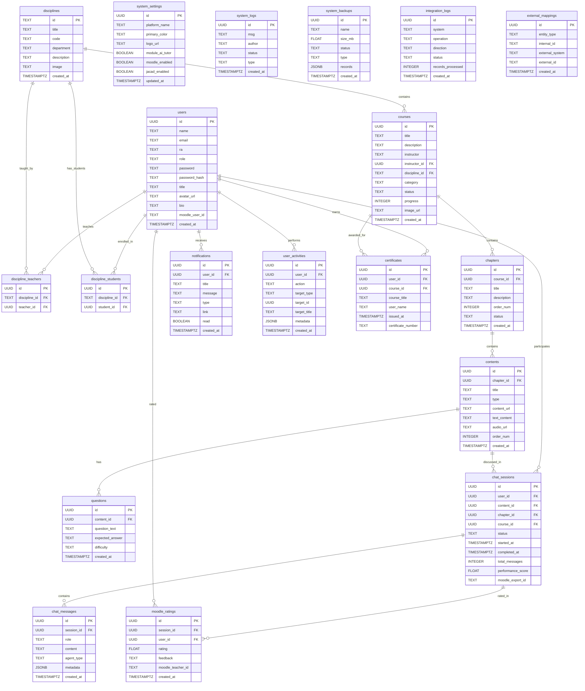

# Harven.ai Database Schema Documentation

> **Generated:** 2026-02-10
> **Source:** Reverse-engineered from `backend/main.py`, `backend/services/integration_service.py`, and `harven.ai-platform-mockup/types.ts`
> **Database:** Supabase (PostgreSQL)
> **Note:** No migration files exist. This schema was inferred entirely from application code and Supabase client operations. Column types are best-effort estimates based on usage patterns.

---

## Table of Contents

1. [Tables Overview](#1-tables-overview)
2. [Table Details](#2-table-details)
3. [Relationships & Foreign Keys](#3-relationships--foreign-keys)
4. [Junction Tables](#4-junction-tables)
5. [Indexes (Inferred)](#5-indexes-inferred)
6. [RLS Policies](#6-rls-policies)
7. [Views and Functions](#7-views-and-functions)
8. [Storage Buckets](#8-storage-buckets)
9. [ER Diagram](#9-er-diagram)

---

## 1. Tables Overview

| # | Table Name | Category | Description |
|---|-----------|----------|-------------|
| 1 | `users` | Core | User accounts (students, teachers, admins) |
| 2 | `disciplines` | Core | Academic disciplines / classes |
| 3 | `discipline_teachers` | Junction | Teachers assigned to disciplines |
| 4 | `discipline_students` | Junction | Students enrolled in disciplines |
| 5 | `courses` | Content | Courses/modules within disciplines |
| 6 | `chapters` | Content | Chapters within courses |
| 7 | `contents` | Content | Content items (video, text, PDF, quiz) within chapters |
| 8 | `questions` | Content | Socratic questions linked to contents |
| 9 | `notifications` | Engagement | User notifications |
| 10 | `user_activities` | Engagement | Activity log for gamification |
| 11 | `user_stats` | Engagement | Aggregated user statistics (optional/precomputed) |
| 12 | `user_achievements` | Engagement | Unlocked achievements per user |
| 13 | `certificates` | Engagement | Course completion certificates |
| 14 | `course_progress` | Engagement | User progress per course (optional/precomputed) |
| 15 | `chat_sessions` | AI/Chat | Socratic dialogue sessions |
| 16 | `chat_messages` | AI/Chat | Messages within chat sessions |
| 17 | `system_settings` | Admin | Platform configuration (singleton) |
| 18 | `system_logs` | Admin | Audit logs / system events |
| 19 | `system_backups` | Admin | Backup records |
| 20 | `moodle_ratings` | Integration | Moodle teacher ratings on sessions |
| 21 | `integration_logs` | Integration | Sync operation logs |
| 22 | `external_mappings` | Integration | ID mapping between Harven and external systems |

---

## 2. Table Details

### 2.1 `users`

Core user table. Stores all platform users regardless of role.

| Column | Type (Inferred) | Nullable | Default | Description |
|--------|-----------------|----------|---------|-------------|
| `id` | `UUID` | NO | `uuid_generate_v4()` | Primary key (generated by app as `uuid.uuid4()`) |
| `name` | `TEXT` | NO | - | Full name |
| `email` | `TEXT` | YES | - | Email address |
| `ra` | `TEXT` | NO | - | Academic registration number (used for login) |
| `role` | `TEXT` | NO | - | `'student'`, `'teacher'`, or `'admin'` |
| `password` | `TEXT` | YES | - | Plain text password (legacy) |
| `password_hash` | `TEXT` | YES | - | Hashed password (not yet implemented) |
| `title` | `TEXT` | YES | - | Professional title |
| `avatar_url` | `TEXT` | YES | - | URL to avatar image in Supabase Storage |
| `bio` | `TEXT` | YES | - | User biography |
| `moodle_user_id` | `TEXT` | YES | - | External Moodle user ID for integration |
| `created_at` | `TIMESTAMPTZ` | YES | `now()` | Creation timestamp |

**Key operations:** Login by RA, filter by role, update avatar, batch insert.

---

### 2.2 `disciplines`

Academic disciplines (classes/turmas).

| Column | Type (Inferred) | Nullable | Default | Description |
|--------|-----------------|----------|---------|-------------|
| `id` | `TEXT` | NO | - | Primary key (set to discipline code by app) |
| `title` | `TEXT` | NO | - | Discipline name |
| `code` | `TEXT` | YES | - | Discipline code (may overlap with `id`) |
| `department` | `TEXT` | YES | - | Department name |
| `description` | `TEXT` | YES | - | Description (referenced in update model, uncertain if column exists) |
| `image` | `TEXT` | YES | - | Cover image URL (tried as `image`, `image_url`, `cover_image`, `thumbnail`) |
| `created_at` | `TIMESTAMPTZ` | YES | `now()` | Creation timestamp |

**Note:** The `id` column is manually set to the discipline `code` value on insert (line 314: `"id": discipline.code`). This is an unconventional pattern.

---

### 2.3 `discipline_teachers`

Junction table linking teachers to disciplines.

| Column | Type (Inferred) | Nullable | Default | Description |
|--------|-----------------|----------|---------|-------------|
| `id` | `UUID` | NO | - | Primary key (generated by app) |
| `discipline_id` | `TEXT` | NO | - | FK to `disciplines.id` |
| `teacher_id` | `UUID` | NO | - | FK to `users.id` |

---

### 2.4 `discipline_students`

Junction table linking students to disciplines.

| Column | Type (Inferred) | Nullable | Default | Description |
|--------|-----------------|----------|---------|-------------|
| `id` | `UUID` | NO | - | Primary key (generated by app) |
| `discipline_id` | `TEXT` | NO | - | FK to `disciplines.id` |
| `student_id` | `UUID` | NO | - | FK to `users.id` |

---

### 2.5 `courses`

Courses (modules) within disciplines.

| Column | Type (Inferred) | Nullable | Default | Description |
|--------|-----------------|----------|---------|-------------|
| `id` | `UUID` | NO | `uuid_generate_v4()` | Primary key (auto-generated by Supabase) |
| `title` | `TEXT` | NO | - | Course title |
| `description` | `TEXT` | YES | - | Course description |
| `instructor` | `TEXT` | YES | - | Instructor name (denormalized string) |
| `instructor_id` | `UUID` | YES | - | FK to `users.id` |
| `discipline_id` | `TEXT` | YES | - | FK to `disciplines.id` |
| `category` | `TEXT` | YES | - | Course category |
| `status` | `TEXT` | YES | `'Rascunho'` | `'Ativa'`, `'Rascunho'`, `'Arquivado'` |
| `progress` | `INTEGER` | YES | `0` | Progress percentage (legacy) |
| `total_modules` | `INTEGER` | YES | `0` | Module count (legacy) |
| `image` | `TEXT` | YES | - | Cover image URL (tried as `image`, `image_url`, `cover_image`, `thumbnail`) |
| `image_url` | `TEXT` | YES | - | Alternative image column |
| `created_at` | `TIMESTAMPTZ` | YES | `now()` | Creation timestamp |

**Note:** Two different create models exist (`CourseCreate` and `CourseCreateReal`) inserting different sets of columns, indicating schema evolution without cleanup.

---

### 2.6 `chapters`

Chapters within courses.

| Column | Type (Inferred) | Nullable | Default | Description |
|--------|-----------------|----------|---------|-------------|
| `id` | `UUID` | NO | `uuid_generate_v4()` | Primary key (auto-generated by Supabase) |
| `course_id` | `UUID` | NO | - | FK to `courses.id` |
| `title` | `TEXT` | NO | - | Chapter title |
| `description` | `TEXT` | YES | `''` | Chapter description |
| `order` | `INTEGER` | YES | `0` | Display order within course |
| `status` | `TEXT` | YES | `'Rascunho'` | Publication status |
| `created_at` | `TIMESTAMPTZ` | YES | `now()` | Creation timestamp |

---

### 2.7 `contents`

Content items (lessons) within chapters.

| Column | Type (Inferred) | Nullable | Default | Description |
|--------|-----------------|----------|---------|-------------|
| `id` | `UUID` | NO | `uuid_generate_v4()` | Primary key (auto-generated by Supabase) |
| `chapter_id` | `UUID` | NO | - | FK to `chapters.id` |
| `title` | `TEXT` | NO | - | Content title |
| `type` | `TEXT` | NO | - | `'video'`, `'text'`, `'pdf'`, `'quiz'`, `'audio'` |
| `content_url` | `TEXT` | YES | - | URL to external media |
| `text_content` | `TEXT` | YES | - | Inline text / extracted PDF text / transcription |
| `audio_url` | `TEXT` | YES | - | Generated TTS audio URL |
| `body` | `TEXT` | YES | - | Alternative text field (referenced in audio summary) |
| `order` | `INTEGER` | YES | `0` | Display order within chapter |
| `created_at` | `TIMESTAMPTZ` | YES | `now()` | Creation timestamp |

---

### 2.8 `questions`

Socratic questions associated with content items.

| Column | Type (Inferred) | Nullable | Default | Description |
|--------|-----------------|----------|---------|-------------|
| `id` | `UUID` | NO | `uuid_generate_v4()` | Primary key (auto-generated by Supabase) |
| `content_id` | `UUID` | NO | - | FK to `contents.id` |
| `question_text` | `TEXT` | NO | - | The question text |
| `expected_answer` | `TEXT` | YES | - | Expected/model answer |
| `difficulty` | `TEXT` | YES | `'medium'` | `'easy'`, `'medium'`, `'hard'` |
| `created_at` | `TIMESTAMPTZ` | YES | `now()` | Creation timestamp |

---

### 2.9 `notifications`

User notifications.

| Column | Type (Inferred) | Nullable | Default | Description |
|--------|-----------------|----------|---------|-------------|
| `id` | `UUID` | NO | - | Primary key (generated by app) |
| `user_id` | `UUID` | NO | - | FK to `users.id` |
| `title` | `TEXT` | NO | - | Notification title |
| `message` | `TEXT` | NO | - | Notification body |
| `type` | `TEXT` | YES | `'info'` | `'info'`, `'warning'`, `'success'`, `'error'` |
| `link` | `TEXT` | YES | - | Optional navigation link |
| `read` | `BOOLEAN` | YES | `false` | Read status |
| `created_at` | `TIMESTAMPTZ` | YES | `now()` | Creation timestamp |

---

### 2.10 `user_activities`

Activity log for gamification and progress tracking.

| Column | Type (Inferred) | Nullable | Default | Description |
|--------|-----------------|----------|---------|-------------|
| `id` | `UUID` | NO | - | Primary key (generated by app) |
| `user_id` | `UUID` | NO | - | FK to `users.id` |
| `action` | `TEXT` | NO | - | `'course_started'`, `'course_completed'`, `'chapter_viewed'`, `'content_completed'`, `'quiz_completed'`, `'login'` |
| `target_type` | `TEXT` | YES | - | `'course'`, `'chapter'`, `'content'`, `'quiz'` |
| `target_id` | `UUID` | YES | - | ID of the target entity |
| `target_title` | `TEXT` | YES | - | Denormalized title of the target |
| `metadata` | `JSONB` | YES | `{}` | Extra data (score, time_spent_minutes, course_id, etc.) |
| `created_at` | `TIMESTAMPTZ` | YES | `now()` | Creation timestamp |

---

### 2.11 `user_stats`

Optional precomputed user statistics table.

| Column | Type (Inferred) | Nullable | Default | Description |
|--------|-----------------|----------|---------|-------------|
| `user_id` | `UUID` | NO | - | FK to `users.id` (possibly PK) |
| `courses_completed` | `INTEGER` | YES | `0` | Number of completed courses |
| `courses_in_progress` | `INTEGER` | YES | `0` | Number of in-progress courses |
| `hours_studied` | `FLOAT` | YES | `0` | Total hours studied |
| `average_score` | `FLOAT` | YES | `0` | Average quiz score |
| `certificates` | `INTEGER` | YES | `0` | Number of certificates |
| `total_activities` | `INTEGER` | YES | `0` | Total logged activities |
| `streak_days` | `INTEGER` | YES | `0` | Consecutive study days |
| `last_activity` | `TIMESTAMPTZ` | YES | - | Last activity timestamp |

**Note:** This table may not exist. The code falls back to computing stats from `user_activities` if this table is missing.

---

### 2.12 `user_achievements`

Records of unlocked achievements.

| Column | Type (Inferred) | Nullable | Default | Description |
|--------|-----------------|----------|---------|-------------|
| `id` | `UUID` | NO | - | Primary key (generated by app) |
| `user_id` | `UUID` | NO | - | FK to `users.id` |
| `achievement_id` | `TEXT` | NO | - | Achievement identifier (matches ALL_ACHIEVEMENTS list) |
| `title` | `TEXT` | YES | - | Denormalized achievement title |
| `description` | `TEXT` | YES | - | Denormalized description |
| `icon` | `TEXT` | YES | - | Material icon name |
| `category` | `TEXT` | YES | - | Achievement category |
| `points` | `INTEGER` | YES | - | Points value |
| `rarity` | `TEXT` | YES | - | `'comum'`, `'raro'`, `'epico'`, `'lendario'` |
| `unlocked_at` | `TIMESTAMPTZ` | YES | `now()` | Unlock timestamp |

**Note:** This table may not exist. The code wraps the insert in a try/except that silently catches errors.

---

### 2.13 `certificates`

Course completion certificates.

| Column | Type (Inferred) | Nullable | Default | Description |
|--------|-----------------|----------|---------|-------------|
| `id` | `UUID` | NO | - | Primary key (generated by app) |
| `user_id` | `UUID` | NO | - | FK to `users.id` |
| `course_id` | `UUID` | NO | - | FK to `courses.id` |
| `course_title` | `TEXT` | YES | - | Denormalized course title |
| `user_name` | `TEXT` | YES | - | Denormalized user name |
| `issued_at` | `TIMESTAMPTZ` | YES | `now()` | Issue date |
| `certificate_number` | `TEXT` | YES | - | Unique certificate ID (format: `HARVEN-XXXXXXXX`) |

---

### 2.14 `course_progress`

Optional precomputed course progress per user.

| Column | Type (Inferred) | Nullable | Default | Description |
|--------|-----------------|----------|---------|-------------|
| `user_id` | `UUID` | NO | - | FK to `users.id` |
| `course_id` | `UUID` | NO | - | FK to `courses.id` |
| `progress_percent` | `INTEGER` | YES | `0` | Progress percentage |
| `completed_contents` | `INTEGER` | YES | `0` | Count of completed contents |
| `total_contents` | `INTEGER` | YES | `0` | Total contents in course |

**Note:** This table may not exist. The code falls back to computing progress from `user_activities` if this table is missing.

---

### 2.15 `chat_sessions`

Socratic dialogue sessions.

| Column | Type (Inferred) | Nullable | Default | Description |
|--------|-----------------|----------|---------|-------------|
| `id` | `UUID` | NO | - | Primary key (generated by app) |
| `user_id` | `UUID` | NO | - | FK to `users.id` |
| `content_id` | `UUID` | NO | - | FK to `contents.id` |
| `chapter_id` | `UUID` | YES | - | FK to `chapters.id` |
| `course_id` | `UUID` | YES | - | FK to `courses.id` |
| `status` | `TEXT` | YES | `'active'` | `'active'`, `'completed'`, `'abandoned'`, `'exported'` |
| `started_at` | `TIMESTAMPTZ` | YES | `now()` | Session start |
| `completed_at` | `TIMESTAMPTZ` | YES | - | Session completion |
| `updated_at` | `TIMESTAMPTZ` | YES | - | Last update |
| `exported_at` | `TIMESTAMPTZ` | YES | - | Moodle export timestamp |
| `total_messages` | `INTEGER` | YES | `0` | Message count |
| `performance_score` | `FLOAT` | YES | - | AI-assessed performance |
| `moodle_export_id` | `TEXT` | YES | - | Moodle export reference |
| `moodle_exported` | `BOOLEAN` | YES | - | Export flag (used in integration service) |

---

### 2.16 `chat_messages`

Messages within chat sessions.

| Column | Type (Inferred) | Nullable | Default | Description |
|--------|-----------------|----------|---------|-------------|
| `id` | `UUID` | NO | - | Primary key (generated by app) |
| `session_id` | `UUID` | NO | - | FK to `chat_sessions.id` |
| `role` | `TEXT` | NO | - | `'user'`, `'assistant'`, `'system'` |
| `content` | `TEXT` | NO | - | Message text |
| `agent_type` | `TEXT` | YES | - | AI agent that generated the message |
| `metadata` | `JSONB` | YES | `{}` | Extra metadata |
| `created_at` | `TIMESTAMPTZ` | YES | `now()` | Message timestamp |

---

### 2.17 `system_settings`

Platform configuration (singleton pattern -- one row).

| Column | Type (Inferred) | Nullable | Default | Description |
|--------|-----------------|----------|---------|-------------|
| `id` | `UUID` | NO | - | Primary key |
| `platform_name` | `TEXT` | YES | `'Academy Platform'` | Platform display name |
| `base_url` | `TEXT` | YES | - | Platform base URL |
| `support_email` | `TEXT` | YES | - | Support email |
| `primary_color` | `TEXT` | YES | `'#D0FF00'` | Theme primary color |
| `logo_url` | `TEXT` | YES | - | Main logo URL |
| `login_logo_url` | `TEXT` | YES | - | Login page logo URL |
| `login_bg_url` | `TEXT` | YES | - | Login page background URL |
| `module_auto_register` | `BOOLEAN` | YES | `true` | Auto-registration module enabled |
| `module_ai_tutor` | `BOOLEAN` | YES | `true` | AI tutor module enabled |
| `module_gamification` | `BOOLEAN` | YES | `true` | Gamification module enabled |
| `module_dark_mode` | `BOOLEAN` | YES | `true` | Dark mode enabled |
| `limit_tokens` | `INTEGER` | YES | `2048` | AI token limit |
| `limit_upload_mb` | `INTEGER` | YES | `500` | Upload size limit (MB) |
| `openai_key` | `TEXT` | YES | `''` | OpenAI API key |
| `anthropic_connected` | `BOOLEAN` | YES | `false` | Anthropic connection status |
| `sso_azure` | `BOOLEAN` | YES | `true` | Azure SSO enabled |
| `sso_google` | `BOOLEAN` | YES | `false` | Google SSO enabled |
| `moodle_url` | `TEXT` | YES | - | Moodle instance URL |
| `moodle_token` | `TEXT` | YES | - | Moodle API token |
| `moodle_enabled` | `BOOLEAN` | YES | `false` | Moodle integration enabled |
| `moodle_sync_frequency` | `TEXT` | YES | `'manual'` | Sync frequency |
| `moodle_last_sync` | `TEXT` | YES | - | Last sync timestamp |
| `moodle_export_format` | `TEXT` | YES | `'xapi'` | Export format |
| `moodle_auto_export` | `BOOLEAN` | YES | `false` | Auto-export enabled |
| `moodle_portfolio_enabled` | `BOOLEAN` | YES | `true` | Portfolio export enabled |
| `moodle_rating_enabled` | `BOOLEAN` | YES | `true` | Rating import enabled |
| `moodle_webhook_secret` | `TEXT` | YES | `''` | Webhook HMAC secret |
| `jacad_enabled` | `BOOLEAN` | YES | `false` | JACAD integration enabled |
| `jacad_url` | `TEXT` | YES | - | JACAD API URL |
| `jacad_api_key` | `TEXT` | YES | - | JACAD API key |
| `jacad_sync_frequency` | `TEXT` | YES | `'manual'` | JACAD sync frequency |
| `jacad_last_sync` | `TEXT` | YES | - | JACAD last sync |
| `jacad_auto_create_users` | `BOOLEAN` | YES | `true` | Auto-create users from JACAD |
| `jacad_sync_enrollments` | `BOOLEAN` | YES | `true` | Sync enrollments from JACAD |
| `smtp_server` | `TEXT` | YES | - | SMTP server address |
| `smtp_port` | `INTEGER` | YES | `587` | SMTP port |
| `smtp_user` | `TEXT` | YES | - | SMTP username |
| `smtp_password` | `TEXT` | YES | - | SMTP password |
| `pwd_min_length` | `INTEGER` | YES | `8` | Minimum password length |
| `pwd_special_chars` | `BOOLEAN` | YES | `true` | Require special chars |
| `pwd_expiration` | `BOOLEAN` | YES | `false` | Password expiration enabled |
| `session_timeout` | `TEXT` | YES | `'30 minutos'` | Session timeout |
| `force_2fa` | `BOOLEAN` | YES | `false` | Force 2FA |
| `firewall_blocked_ips` | `TEXT` | YES | `''` | Blocked IPs |
| `firewall_whitelist` | `TEXT` | YES | `''` | Whitelisted IPs |
| `backup_enabled` | `BOOLEAN` | YES | `true` | Backup enabled |
| `backup_frequency` | `TEXT` | YES | `'Diario'` | Backup frequency |
| `backup_retention` | `INTEGER` | YES | `30` | Retention days |
| `last_force_logout` | `TEXT` | YES | - | Last force logout timestamp |
| `updated_at` | `TIMESTAMPTZ` | YES | - | Last update |

---

### 2.18 `system_logs`

Audit log / system events.

| Column | Type (Inferred) | Nullable | Default | Description |
|--------|-----------------|----------|---------|-------------|
| `id` | `UUID` | NO | `uuid_generate_v4()` | Primary key (auto-generated) |
| `msg` | `TEXT` | YES | - | Log message |
| `author` | `TEXT` | YES | - | Author / actor name |
| `status` | `TEXT` | YES | - | Status (`'Enviado'`, `'Agendado'`, `'Executado'`, `'Sucesso'`) |
| `color` | `TEXT` | YES | - | Display color hint |
| `type` | `TEXT` | YES | - | Log type (`'BACKUP'`, `'SECURITY'`, `'CACHE'`) |
| `created_at` | `TIMESTAMPTZ` | YES | `now()` | Log timestamp |

---

### 2.19 `system_backups`

Backup records (metadata only, not actual data).

| Column | Type (Inferred) | Nullable | Default | Description |
|--------|-----------------|----------|---------|-------------|
| `id` | `UUID` | NO | `uuid_generate_v4()` | Primary key (auto-generated) |
| `name` | `TEXT` | YES | - | Backup filename |
| `size_mb` | `FLOAT` | YES | - | Estimated size in MB |
| `status` | `TEXT` | YES | - | `'completed'` |
| `type` | `TEXT` | YES | - | `'manual'`, `'automatic'` |
| `records` | `JSONB` | YES | - | Record counts snapshot |
| `created_by` | `TEXT` | YES | - | Who triggered the backup |
| `created_at` | `TIMESTAMPTZ` | YES | `now()` | Backup timestamp |

---

### 2.20 `moodle_ratings`

Teacher ratings received from Moodle.

| Column | Type (Inferred) | Nullable | Default | Description |
|--------|-----------------|----------|---------|-------------|
| `id` | `UUID` | NO | `uuid_generate_v4()` | Primary key |
| `session_id` | `UUID` | YES | - | FK to `chat_sessions.id` |
| `user_id` | `UUID` | YES | - | FK to `users.id` |
| `rating` | `FLOAT` | YES | - | Teacher rating |
| `feedback` | `TEXT` | YES | - | Teacher feedback text |
| `moodle_teacher_id` | `TEXT` | YES | - | External Moodle teacher ID |
| `created_at` | `TIMESTAMPTZ` | YES | `now()` | Rating timestamp |

---

### 2.21 `integration_logs`

Sync operation logs for integrations.

| Column | Type (Inferred) | Nullable | Default | Description |
|--------|-----------------|----------|---------|-------------|
| `id` | `UUID` | NO | `uuid_generate_v4()` | Primary key |
| `system` | `TEXT` | YES | - | `'jacad'` or `'moodle'` |
| `operation` | `TEXT` | YES | - | Operation name |
| `direction` | `TEXT` | YES | - | `'import'` or `'export'` |
| `status` | `TEXT` | YES | - | `'success'`, `'failed'`, `'partial'` |
| `records_processed` | `INTEGER` | YES | - | Total records processed |
| `records_created` | `INTEGER` | YES | - | Records created |
| `records_updated` | `INTEGER` | YES | - | Records updated |
| `records_failed` | `INTEGER` | YES | - | Records that failed |
| `error_message` | `TEXT` | YES | - | Error details |
| `created_at` | `TIMESTAMPTZ` | YES | `now()` | Log timestamp |

---

### 2.22 `external_mappings`

ID mapping between Harven.ai and external systems.

| Column | Type (Inferred) | Nullable | Default | Description |
|--------|-----------------|----------|---------|-------------|
| `id` | `UUID` | NO | `uuid_generate_v4()` | Primary key |
| `entity_type` | `TEXT` | YES | - | `'user'`, `'discipline'`, `'session'` |
| `internal_id` | `UUID/TEXT` | YES | - | Harven.ai entity ID |
| `external_system` | `TEXT` | YES | - | `'jacad'` or `'moodle'` |
| `external_id` | `TEXT` | YES | - | External system entity ID |
| `created_at` | `TIMESTAMPTZ` | YES | `now()` | Mapping creation timestamp |

---

## 3. Relationships & Foreign Keys

| Parent Table | Child Table | FK Column | Relationship |
|-------------|-------------|-----------|-------------|
| `disciplines` | `courses` | `discipline_id` | One discipline has many courses |
| `courses` | `chapters` | `course_id` | One course has many chapters |
| `chapters` | `contents` | `chapter_id` | One chapter has many contents |
| `contents` | `questions` | `content_id` | One content has many questions |
| `users` | `notifications` | `user_id` | One user has many notifications |
| `users` | `user_activities` | `user_id` | One user has many activities |
| `users` | `user_achievements` | `user_id` | One user has many achievements |
| `users` | `certificates` | `user_id` | One user has many certificates |
| `courses` | `certificates` | `course_id` | One course has many certificates |
| `users` | `chat_sessions` | `user_id` | One user has many chat sessions |
| `contents` | `chat_sessions` | `content_id` | One content has many chat sessions |
| `chapters` | `chat_sessions` | `chapter_id` | One chapter has many chat sessions |
| `courses` | `chat_sessions` | `course_id` | One course has many chat sessions |
| `chat_sessions` | `chat_messages` | `session_id` | One session has many messages |
| `chat_sessions` | `moodle_ratings` | `session_id` | One session has many ratings |
| `users` | `moodle_ratings` | `user_id` | One user has many ratings |

**WARNING:** It is unknown whether these are enforced as actual PostgreSQL foreign key constraints or are merely logical relationships enforced only at the application level.

---

## 4. Junction Tables

### `discipline_teachers`
- Links: `disciplines` <-> `users` (where role = 'teacher')
- Composite unique: `(discipline_id, teacher_id)` -- unknown if DB enforced

### `discipline_students`
- Links: `disciplines` <-> `users` (where role = 'student')
- Composite unique: `(discipline_id, student_id)` -- unknown if DB enforced

---

## 5. Indexes (Inferred)

No explicit index definitions were found in the codebase. The following indexes are **recommended** based on query patterns observed in `main.py`:

| Table | Columns | Query Pattern |
|-------|---------|---------------|
| `users` | `ra` | Login: `eq("ra", data.ra)` |
| `users` | `role` | Filter: `eq("role", target_role)` |
| `discipline_teachers` | `teacher_id` | Filter: `eq("teacher_id", user_id)` |
| `discipline_teachers` | `discipline_id` | Filter: `eq("discipline_id", discipline_id)` |
| `discipline_students` | `student_id` | Filter: `eq("student_id", user_id)` |
| `discipline_students` | `discipline_id` | Filter: `eq("discipline_id", discipline_id)` |
| `courses` | `discipline_id` | Filter: `eq("discipline_id", class_id)` |
| `chapters` | `course_id` | Filter: `eq("course_id", course_id)` |
| `contents` | `chapter_id` | Filter: `eq("chapter_id", chapter_id)` |
| `questions` | `content_id` | Filter: `eq("content_id", content_id)` |
| `notifications` | `user_id, read` | Filter: `eq("user_id", uid).eq("read", False)` |
| `user_activities` | `user_id, action` | Multiple filters on user + action |
| `chat_sessions` | `user_id, content_id` | Lookup: `eq("user_id", uid).eq("content_id", cid)` |
| `chat_messages` | `session_id` | Filter: `eq("session_id", sid)` |
| `system_logs` | `created_at` | Order: `order("created_at", desc=True)` |
| `system_logs` | `type` | Filter: `eq("type", log_type)` |

---

## 6. RLS Policies

**No RLS policies were found in the codebase.** The backend connects to Supabase using the service key (`SUPABASE_KEY`), which typically bypasses RLS. The frontend Supabase client (`lib/supabase.ts`) uses the anon key but does not appear to make direct database queries (all operations go through the FastAPI backend).

**Current state:** All data access is controlled at the application level in `main.py`. There are no database-level security policies.

---

## 7. Views and Functions

**No database views or functions were found in the codebase.** All data transformations (counting, filtering, joining) are performed in Python application code.

---

## 8. Storage Buckets

The application references several Supabase Storage buckets with a fallback strategy:

| Bucket Name | Purpose | Priority |
|-------------|---------|----------|
| `avatars` | User avatar images | 1st for avatars |
| `courses` | Course cover images & content files | 1st for courses |
| `audio-files` | Generated TTS audio | 1st for audio |
| `public` | Fallback bucket | Last resort |

The upload pattern across all endpoints is: try the primary bucket, then fall through to alternatives until one succeeds.

---

## 9. ER Diagram

---

*End of Schema Documentation*
